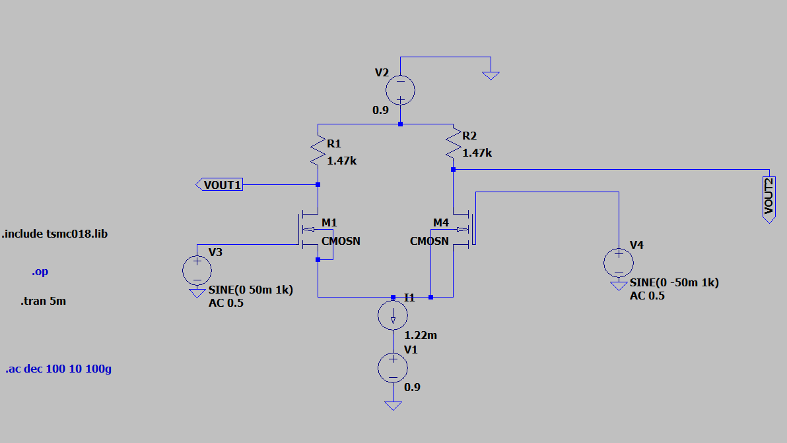
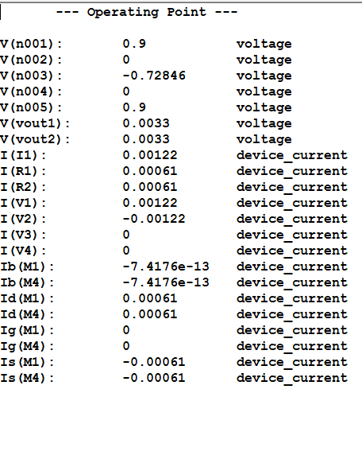
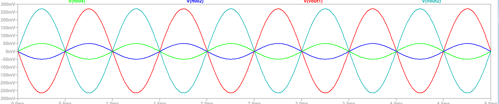
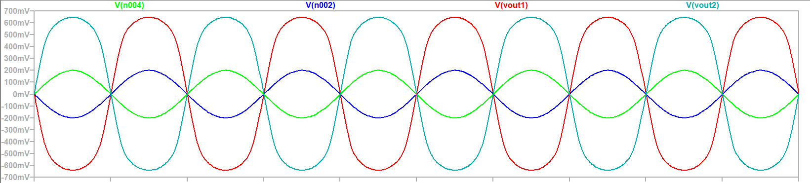
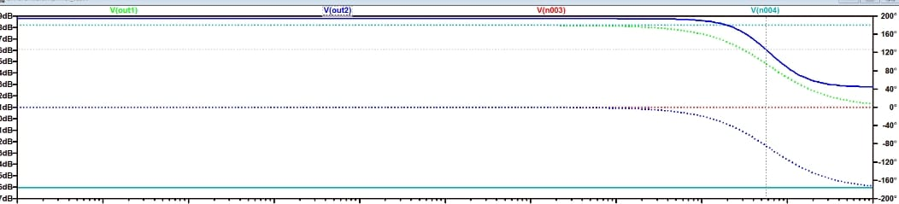
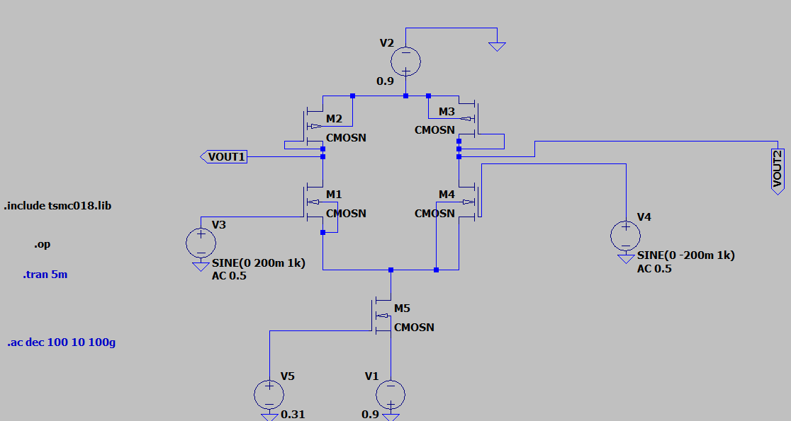
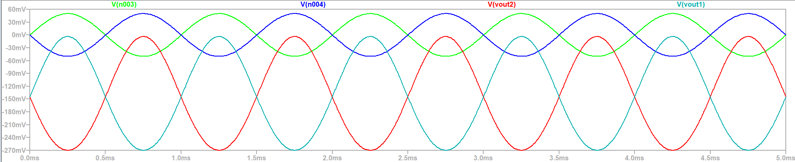
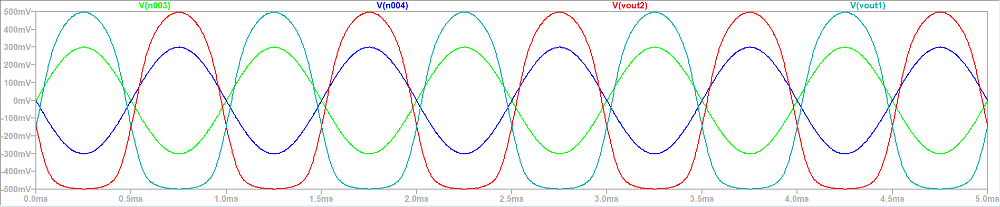
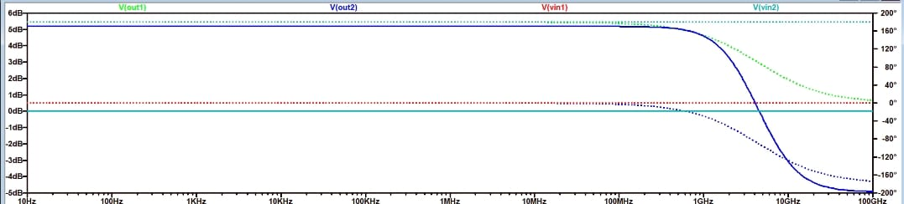

# differential_Amplifier_Analysis
# Experiment 04  
## Differential Amplifier Analysis  

---

## Aim  
The objective of this experiment is to design and simulate three MOSFET-based differential amplifier circuits using LT Spice software. The circuits are analyzed using DC, transient, and AC analyses in order to evaluate important performance parameters such as voltage gain, bandwidth, linearity, and power consumption.

---

## Introduction  
The differential amplifier is one of the most essential building blocks in analog electronics. It is primarily used to amplify the difference between two input signals while rejecting any signal that is common to both inputs. This property, known as common-mode rejection, makes differential amplifiers highly useful in noise-sensitive applications.

MOSFET-based differential amplifiers are extensively used in integrated circuit design, especially in operational amplifiers, comparators, and analog front-end circuits. Compared to single-ended amplifiers, differential amplifiers offer better noise immunity, improved linearity, and higher stability.

In this experiment, a MOSFET differential amplifier is designed using LT Spice, and its performance is analyzed through various simulation techniques.

---

## Theory  

### 1. Basic Principle  
A differential amplifier amplifies the difference between two input voltages:

vid = vin1 − vin2  

The output voltage is proportional to this difference:

vo ∝ (vin1 − vin2)

If both inputs are equal (common-mode signal), the output ideally becomes zero.

---

### 2. Circuit Operation  

The MOS differential amplifier consists of:
- Two matched MOSFETs (M1 and M2)  
- A constant current source (tail current ISS)  
- Load elements (resistors or active loads)  

The total current ISS is shared between the two transistors depending on the input voltages.

- When vin1 = vin2 → current splits equally  
- When vin1 > vin2 → more current flows through M1  
- When vin2 > vin1 → more current flows through M2  

This current difference is converted into output voltage through the load.

---

### 3. Modes of Operation  

#### (a) Differential Mode  
When the inputs are different:  
- Output depends on vid  
- Desired mode of operation  

#### (b) Common Mode  
When vin1 = vin2:  
- Ideally no output  
- Practical circuits show small output due to imperfections  

---

### 4. Small Signal Analysis  

For small input signals, both MOSFETs operate in saturation, and the circuit behaves linearly.

The differential gain is given by:

Av = gm × Rout  

Where:  
- gm = transconductance  
- Rout = output resistance  

---

### 5. Transconductance  

gm = 2ID / VOV  

Where:  
- ID = drain current  
- VOV = overdrive voltage (VGS − VT)  

Higher gm leads to higher gain.

---

### 6. Output Resistance  

The output resistance depends on:
- Drain resistance (RD)  
- MOSFET output resistance (ro)  

Rout = RD || ro  

---

### 7. Large Signal Behavior  

For large input signals:

vid > 2VOV  

One MOSFET enters cutoff, and the circuit becomes nonlinear. This results in distortion in the output waveform.

---

### 8. Linearity Condition  

For proper linear operation:

|vid| < √2 VOV  

Beyond this range, the amplifier loses linearity.

---

### 9. Frequency Response  

At low frequencies:
- Gain remains constant (midband region)

At high frequencies:
- Gain decreases due to parasitic capacitances  

Bandwidth is defined between −3 dB cutoff points.

---

### 10. Types of Loads  

- Resistive Load → Moderate gain  
- Active Load → Higher gain  
- Current Mirror Load → Highest gain  

---

## Circuit 1: Differential Amplifier with Resistive Load  

### Working  
The circuit uses two NMOS transistors with resistors connected at the drain terminals.

vid = vin1 − vin2  

The tail current ISS is shared between both transistors depending on the input difference.

- Increase in vin1 → current in M1 increases  
- Increase in vin2 → current in M2 increases  

The output voltage is obtained due to voltage drop across RD.

- Small signals → linear output  
- Large signals → distortion  

---

## Design Calculations  

### Given Values  
- Technology = TSMC 180 nm  
- VDD = +0.9 V  
- VSS = −0.9 V  
- Power ≤ 2.2 mW  
- Ln = 540 nm  
- Vin,CM = 0 V  
- Vo,CM = 0 V  
- Vp = −0.7 V  
- CL = 10 pF  
- VT ≈ 0.36 V  

---

### Power Calculation  

P = (VDD − VSS) × ISS  

1.8 × ISS ≤ 2.2 × 10⁻³  

ISS ≤ 1.22 mA  

Chosen:  
ISS = 1.22 mA  

---

### Drain Current  

ID = ISS / 2 = 0.61 mA  

---

### Load Resistance  

Vout = VDD − ID RD  

0 = 0.9 − ID RD  

RD ≈ 1.475 kΩ  

---

### Bias Conditions  

VG = 0 V  
VS = −0.7 V  

VGS = 0.7 V  
VOV = 0.34 V  

VDS = 0.7 V  

Since VDS > VOV → saturation region satisfied  

---

### Width Calculation  

ID = (1/2) μnCox (W/L) (VOV)²  

Calculated:  
W ≈ 24.1 µm  

Adjusted after simulation:  
W ≈ 32 µm  

---

## DC Analysis  

The DC operating point verifies that:
- All transistors are properly biased  
- Operating region is saturation  
- Node voltages match expected theoretical values  

---

## Input Common Mode Range (ICMR)  

VICM(min) = VS + VT = −0.34 V  

VICM(max) = VD + VT = 0.36 V  

Final Range:  
−0.34 V ≤ VICM ≤ 0.36 V  

---

## Output Common Mode Range (OCMR)  

VOCM(max) = VDD = 0.9 V  

VOCM(min) = VS + VOV = −0.36 V  

Final Range:  
−0.36 V ≤ VOCM ≤ 0.9 V  

---

## Transient Analysis  

### Linearity Condition  
|vid| < √2 VOV  

---

### Case 1: Linear Operation 

- Input = 100 mV  
- Output = clean sinusoidal waveform  
- No distortion  
- Both MOSFETs in saturation  

---

### Case 2: Nonlinear Operation 

- Input = 600 mV  
- Output shows distortion and clipping  
- One transistor moves toward cutoff  

---

### Conclusion  
The amplifier operates linearly only for small input signals:  

|vid| < 2VOV  

---

## Simulated Gain  

Vin(pp) = 100 mV  
Vout(pp) ≈ 550 mV  

Av ≈ 5.5  

Av(dB) ≈ 14.8 dB  

---

## Theoretical Gain  

ro ≈ 16.39 kΩ  
ro_eff ≈ 8.2 kΩ  

gm ≈ 3.59 mS  

Rout ≈ 1.25 kΩ  

Ad ≈ 4.49  

Ad(dB) ≈ 13.05 dB  

---

## AC Analysis  

Midband Gain ≈ 14.8 dB  

fL ≈ 0 Hz  
fH ≈ 4.819 MHz  

Bandwidth ≈ 4.819 MHz  

---

## Unity Gain Bandwidth (UGB)  

UGB = Av × BW  

UGB ≈ 26.5 MHz  

---

## Comparison of Results  

| Parameter | Theoretical | Simulated |
|----------|------------|-----------|
| Gain (V/V) | 4.49 | 5.5 |
| Gain (dB) | 13.05 dB | 14.8 dB |

---

## Discussion on Variation Between Theoretical and Simulated Results  

The difference between theoretical and simulated results arises due to practical non-ideal effects that are not considered in simplified analytical models.

### Key Factors  

1. Channel Length Modulation reduces effective output resistance  
2. Finite output resistance (ro) lowers gain  
3. Mobility degradation reduces gm  
4. Parasitic capacitances affect AC response and bandwidth  
5. Variations in VOV alter operating point  
6. Advanced MOSFET models include second-order effects  
7. Measurement inaccuracies in waveform analysis  

---

## Final Inference  

The MOSFET differential amplifier with resistive load has been successfully designed and analyzed using LT Spice. The circuit demonstrates proper biasing, expected gain, and stable operation. Linear behavior is observed for small input signals, while distortion appears at higher inputs. The deviation between theoretical and simulated results is justified and confirms the presence of real-world non-idealities.

# Circuit 2  
## Differential Amplifier with PMOS Active Load  

---

## Aim  
To design and analyze a CMOS differential amplifier using NMOS input transistors and PMOS active load, ensuring proper biasing, saturation operation, and evaluation of gain, bandwidth, and linearity through simulation.

---

## Given Parameters  
- Technology: TSMC 180 nm  
- VDD = +0.9 V  
- VSS = −0.9 V  
- Power Constraint: ≤ 2.2 mW  
- Channel Length (L) = 540 nm  

---

## Design Objective  
The circuit is designed to satisfy the following conditions:

- Tail current ISS ≈ 1.22 mA  
- Source node voltage Vp ≈ −0.7 V  
- All MOSFETs must operate in saturation region  
- Symmetrical operation under zero differential input  

---

## Theory  

### 1. CMOS Differential Amplifier Concept  
A CMOS differential amplifier consists of:

- NMOS differential pair (M1, M2)  
- PMOS active load (M3, M4)  
- NMOS current source (M5)  

Unlike resistive load circuits, PMOS transistors act as active loads, providing higher output resistance and improved gain.

---

### 2. Working Principle  

The differential input is defined as:

vid = vin1 − vin2  

- If vin1 > vin2 → M1 conducts more current  
- If vin2 > vin1 → M2 conducts more current  

The tail current ISS is steered between the two branches.  
The PMOS load converts current variations into output voltage.

---

### 3. Advantage of Active Load  

- Higher output resistance  
- Increased voltage gain  
- Reduced area compared to resistors  
- Better integration in IC design  

---

### 4. Small Signal Gain  

The differential gain is given by:

Av = gm × Rout  

Where:

- gm = transconductance of NMOS  
- Rout = effective output resistance  

For active load:

Rout = ron || rop  

---

### 5. Large Signal Behavior  

When:

vid > 2VOV  

One transistor turns OFF, and current flows entirely in one branch, causing distortion.

---

## Current Calculation  

From power constraint:

P = (VDD − VSS) × ISS  

ISS = 2.2 mW / 1.8 V  

ISS ≈ 1.22 mA  

---

## Transistor Dimensions  

### Input Pair  
- M1: W = 36 µm, L = 540 nm  
- M2: W = 36 µm, L = 540 nm  

### Tail Current Source  
- M5: W = 228 µm, L = 540 nm  

---

## Biasing Condition  

The gate voltage of M5 is adjusted such that:

Vp ≈ −0.7 V  

This ensures:

- Stable tail current  
- Proper saturation of M5  
- Balanced operation  

---

## DC Operating Point Analysis  

Expected results:

- ISS ≈ 1.22 mA  
- ID1 = ID2 ≈ 0.61 mA  
- Source node voltage ≈ −0.7 V  
- Output nodes symmetric (Vout1 ≈ Vout2)  

All transistors remain in saturation.

---

## Input Common Mode Range (ICMR)  

### Minimum Value  

VICM(min) = VS + VT  

VICM(min) = −0.7 + 0.36  

VICM(min) = −0.34 V  

---

### Maximum Value  

VICM(max) = VD + |VTP|  

VICM(max) = 0 + 0.39  

VICM(max) = 0.39 V  

---

### Final Range  

−0.34 V ≤ VICM ≤ 0.39 V  

---

## Output Common Mode Range (OCMR)  

### Minimum Output  

Vout(min) = VS + VOVn  

Vout(min) = −0.7 + 0.34  

Vout(min) = −0.36 V  

---

### Maximum Output  

Vout(max) = VDD − VOVp  

Vout(max) = 0.9 − 0.25  

Vout(max) = 0.65 V  

---

### Final Range  

−0.36 V ≤ Vout ≤ 0.65 V  

---

## Differential Input Range (Linearity)  

Maximum differential input:

vid(max) = 2VOVn  

vid(max) = 2 × 0.34  

vid(max) = 0.68 V  

---

### Linear Region Condition  

|vid| < √2 VOV  

---

## Transient Analysis  

### Case 1: Linear Operation  

- Input: 100 mV  
- Output: sinusoidal waveform  
- No distortion  
- All MOSFETs in saturation  

---

### Case 2: Nonlinear Operation  

- Input: 600 mV  
- Output: distorted waveform  
- One NMOS enters cutoff  
- Current flows in one branch  

---

### Interpretation  

- Small signal → balanced current sharing → linear output  
- Large signal → current steering → distortion  

---

## Simulated Gain  

Vin(pp) = 100 mV  
Vout(pp) = 181 mV  

Av ≈ 1.81  

Av(dB) ≈ 5.15 dB  

---

## Theoretical Gain  

### Output Resistance  

ro ≈ 16.39 kΩ  

ro_eff = ron || rop ≈ 8.2 kΩ  

---

### Transconductance  

gm ≈ 4.11 mS  

---

### Gain  

Ad = gm × Rout  

Ad ≈ 33.7  

Ad(dB) ≈ 30.55 dB  

---

## Reason for Difference Between Theoretical and Simulated Gain  

A large deviation is observed between theoretical and simulated gain due to practical non-idealities.

### Major Reasons  

1. **Channel Length Modulation**  
   Reduces output resistance and hence gain.

2. **Finite Output Resistance of Current Source (M5)**  
   The tail current source is not ideal, causing gain reduction.

3. **Non-Ideal PMOS Active Load**  
   M3 and M4 do not behave as perfect current sources.

4. **Mobility Degradation**  
   Reduces gm, lowering gain.

5. **Variation in Overdrive Voltage**  
   Affects operating point and gain.

6. **Parasitic Capacitances**  
   Affect both transient and AC response.

7. **Large Signal Operation**  
   Simulation may include nonlinear region effects.

8. **Mismatch and Device Modeling**  
   Realistic MOS models include second-order effects.

---

## AC Analysis  

### Midband Gain  
≈ 5.2 dB  

### Cutoff Frequencies  
- fL ≈ 0 Hz  
- fH ≈ 2.2 GHz  

---

### Bandwidth  

BW ≈ 2.2 GHz  

---

## Unity Gain Bandwidth (UGB)  

UGB = Av × fH  

UGB ≈ 1.81 × 4.8 GHz  

UGB ≈ 8.69 GHz  

---

## Comparison of Results  

| Parameter | Theoretical | Simulated |
|----------|------------|-----------|
| Gain (V/V) | 33.7 | 1.81 |
| Gain (dB) | 30.55 dB | 5.15 dB |

---

## Discussion  

The theoretical analysis assumes ideal MOSFET behavior, while simulation incorporates practical effects such as:

- Channel length modulation  
- Finite output resistance  
- Mobility degradation  
- Parasitic capacitances  

These significantly reduce the gain in practical circuits.

---

## Final Inference  

The CMOS differential amplifier with PMOS active load and NMOS current source has been successfully designed and analyzed.

The circuit satisfies:
- Power constraint ≤ 2.2 mW  
- Proper biasing (Vp ≈ −0.7 V)  
- Saturation operation for all transistors  

Although the theoretical gain is high, the simulated gain is much lower due to real-world non-ideal effects. The circuit demonstrates correct functionality, expected frequency response, and clear linear-to-nonlinear transition behavior.
